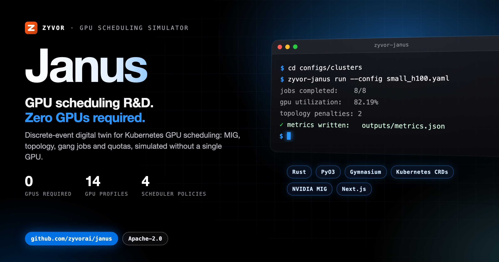
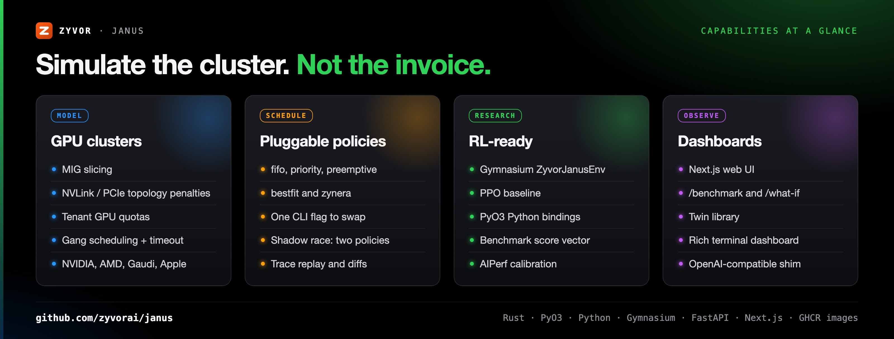
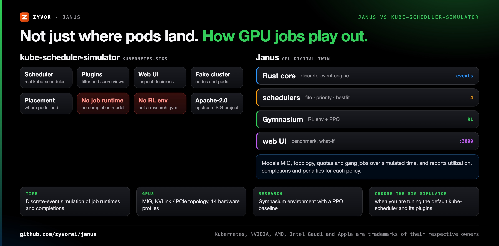
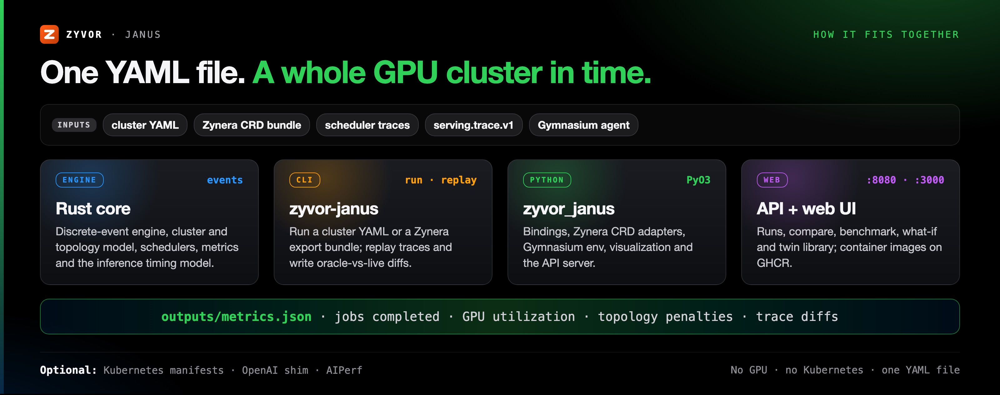

<div align="center">

# Janus

[](https://github.com/zyvorai/janus/actions/workflows/rust.yml)
[](https://github.com/zyvorai/janus/actions/workflows/python.yml)
[](https://github.com/zyvorai/janus/actions/workflows/benchmark.yml)
[](https://github.com/zyvorai/janus/actions/workflows/docker-publish.yml)
[](https://github.com/zyvorai/janus/releases)
[](LICENSE)
[](Cargo.toml)

[](https://zyvor.dev/schedule?utm_source=github&utm_medium=janus&utm_campaign=readme_hero)
[](https://zyvor.dev/poc?utm_source=github&utm_medium=janus&utm_campaign=readme_hero)
[](#quickstart)



### GPU scheduling R&D. Zero GPUs required.

**A discrete-event simulator for Kubernetes-native GPU scheduling.** Zyvor Janus models clusters, MIG, topology, tenants, quotas, gang scheduling, and AI workloads — so you can develop schedulers, run RL research, and evaluate performance without physical GPUs. It is the digital twin of [Zynera](https://zyvor.dev/zynera), Zyvor's production GPU/Kubernetes control plane.

**0 GPUs required** · **14 hardware profiles** · **4 scheduler policies** · **Gymnasium + PPO** · **Apache-2.0**

📖 **[Docs](docs/)** · [zyvor.dev/zynera](https://zyvor.dev/zynera) · [Blog](https://zyvor.dev/blog)

</div>

---

## What's new

| Change | What it does |
|---|---|
| **GPU kinds** | Hardware profiles for NVIDIA (H100 through B200, L4, A10G, RTX 4090), AMD MI300X/MI250, Intel Gaudi 3 and Apple M-series, plus a cluster (`configs/clusters/gpu_kinds.yaml`) that places one job on each kind |
| **Shadow race** | Pick a "Shadow vs" scheduler on Launch simulation and watch a live head-to-head race, then a full metrics comparison with a computed winner |
| **Twin library** | A `/twins` page in the web dashboard to browse calibrated GPU/model twins (`GET /api/twins`) |
| **AIPerf overlay** | Sim-vs-measured AIPerf overlay on the benchmark page |
| **Rename** | ZyForgeSim/ForgeSim is now **Zyvor Janus**: crates `zyvor-janus-*`, CLI `zyvor-janus`, Python `zyvor_janus`, env vars `ZYVOR_JANUS_*` |

Full history: [CHANGELOG.md](CHANGELOG.md).

## Why Janus

| When this happens… | Janus gives you… |
|---|---|
| Testing a scheduler change means booking scarce GPUs | Full discrete-event simulation of cluster placement, MIG slicing, NVLink/PCIe topology penalties and gang scheduling, with no GPUs |
| You can't tell how a policy would have done on production load | Import real `FabricAIJob` / `FabricGpuNode` / `FabricQuota` CRDs and replay production scheduler traces for oracle-vs-live diffing |
| Comparing policies means rewriting harnesses | `fifo`, `priority`, `preemptive`, `bestfit` and Zynera's own policy, swappable with one CLI flag |
| RL scheduling research has no realistic environment | A Gymnasium environment and a PPO baseline |
| Results live in log files nobody reads | Rich terminal dashboard, Next.js web UI (runs, benchmark, what-if), and an OpenAI-compatible inference shim for calibrated LLM serving metrics |
| A mixed fleet is hard to reason about | Shipped profiles for NVIDIA, AMD, Intel Gaudi and Apple M-series |



---

## Janus vs kube-scheduler-simulator



| | **Janus** | **kube-scheduler-simulator** (kubernetes-sigs) |
|---|---|---|
| What it simulates | GPU jobs over simulated time: arrival, placement, runtime, preemption, completion | The kube-scheduler's decisions for Pods in a simulated cluster |
| Scheduler | Its own policies: `fifo`, `priority`, `preemptive`, `bestfit`, `zynera` | The real kube-scheduler and its plugins |
| GPU model | MIG slicing, NVLink/PCIe topology penalties, 14 hardware profiles | General Kubernetes resources |
| Workloads | Gang jobs, tenant quotas, synthetic LLM serving workloads, trace replay | Pods and nodes you create |
| Outputs | `outputs/metrics.json`: jobs completed, GPU utilization, topology penalties; trace diffs; benchmark score | Per-plugin filter and score results in a web UI |
| Research | Gymnasium environment, PPO baseline, PyO3 bindings | Not its focus |
| **Choose kube-scheduler-simulator when** | | You are tuning the default kube-scheduler and its plugins and want to see its real decisions |

---

## How it fits together



<a id="architecture"></a>

- **Rust core** — event engine, cluster model, schedulers, metrics, Zynera bundle loader, inference timing model
- **Python API** — PyO3 bindings, Zynera CRD adapters, Gymnasium env, visualization, FastAPI server, AIPerf adapters
- **Web UI** — Next.js dashboard (runs, benchmark, what-if) + Rich CLI live dashboard

Design detail: [docs/architecture.md](docs/architecture.md).

---

<a id="quick-start"></a>

## Quickstart

```bash
git clone https://github.com/zyvorai/janus.git
cd janus
cargo run -p zyvor-janus-cli -- run --config configs/clusters/small_h100.yaml
```

A full cluster simulation with no GPU, no Kubernetes, and one YAML file. Requirements: a Rust toolchain (pinned in [`rust-toolchain.toml`](rust-toolchain.toml)); Python only for the bindings, RL and web API.

<details>
<summary><b>▸ Zynera export bundle</b> — test Zynera without GPUs</summary>

```bash
mkdir -p zynera-export/{jobs,cluster,quotas}
kubectl get fabricaijobs -A -o yaml > zynera-export/jobs/all.yaml
kubectl get fabricgpunodes -o yaml > zynera-export/cluster/nodes.yaml
kubectl get fabricquotas -A -o yaml > zynera-export/quotas/all.yaml

cargo run -p zyvor-janus-cli -- run \
  --zynera-bundle zynera-export \
  --profiles-dir configs/profiles

# Or use the included fixture:
cargo run -p zyvor-janus-cli -- run \
  --zynera-bundle tests/fixtures/zynera \
  --profiles-dir configs/profiles
```

</details>

<details>
<summary><b>▸ Scheduler policies</b> — fifo · priority · preemptive · bestfit · zynera</summary>

```bash
cargo run -p zyvor-janus-cli -- run --config configs/clusters/priority_scheduler.yaml
cargo run -p zyvor-janus-cli -- run --config configs/clusters/preemption_preemptive.yaml
cargo run -p zyvor-janus-cli -- run \
  --zynera-bundle tests/fixtures/zynera \
  --scheduler zynera
```

</details>

<details>
<summary><b>▸ Trace replay</b> — compare vs production Zynera</summary>

```bash
cargo run -p zyvor-janus-cli -- replay \
  --trace tests/fixtures/traces/fifo_match.jsonl \
  --config configs/clusters/single_gpu.yaml
```

Writes `outputs/trace_diff.json` with oracle vs FIFO placement diffs.

</details>

<details>
<summary><b>▸ MIG simulation</b> — fractional GPU slices</summary>

```bash
cargo run -p zyvor-janus-cli -- run --config configs/clusters/mig_single.yaml
```

</details>

<details>
<summary><b>▸ Dual-node preemption</b> — placement migrate (not live CUDA)</summary>

```bash
cargo run -p zyvor-janus-cli -- run --config configs/clusters/dual_node_preempt.yaml
```

This is a **digital-twin placement migrate**. Zynera's production live migrate is KubeVirt VMs — see Zynera docs for Path A / Path B.

</details>

## Installation

### Container images (GHCR)

```bash
docker pull ghcr.io/zyvorai/zyvor-janus-api:latest
docker pull ghcr.io/zyvorai/zyvor-janus-web:latest

docker network create zyvor-janus 2>/dev/null || true
docker run -d --name zyvor-janus-api --network zyvor-janus -p 8080:8080 \
  ghcr.io/zyvorai/zyvor-janus-api:latest
docker run -d --name zyvor-janus-web --network zyvor-janus -p 3000:3000 \
  -e ZYVOR_JANUS_API_URL=http://zyvor-janus-api:8080 \
  ghcr.io/zyvorai/zyvor-janus-web:latest
```

Open http://localhost:3000 (default login `Admin` / `Admin@321` — override via `ZYVOR_JANUS_DASHBOARD_USER` / `ZYVOR_JANUS_DASHBOARD_PASSWORD`). Pin a release with `:vX.Y.Z`.

### Kubernetes

```bash
cd deploy/kubernetes
cp secret.example.yaml secret.yaml   # edit credentials
kubectl apply -f secret.yaml
kubectl apply -k .
```

See [`deploy/kubernetes/README.md`](deploy/kubernetes/README.md).

### From source

```bash
cargo build --release -p zyvor-janus-cli

# Optional: Python bindings + web API
./scripts/setup_dev.sh
source .venv/bin/activate
pip install -e '.[server]'
```

See [`CONTRIBUTING.md`](CONTRIBUTING.md) for `viz`, `rl`, and `dashboard` extras.

## Project layout

```text
crates/              Rust workspace (core, topology, scheduler, simulator, CLI, API, PyO3)
python/              Python package, Gymnasium env, dashboard, baselines
web/                 Next.js UI
configs/             Cluster YAMLs + calibrated profiles
tests/fixtures/      Zynera, traces, AIPerf, benchmark goldens
docs/                Architecture, milestones, UI, benchmark platform, deploy
```

## Zynera input

See [docs/zynera_input.md](docs/zynera_input.md) for CRD mapping rules, export workflow, and adapter levels.

---

<a id="milestones"></a>

## Maturity

See [docs/milestones.md](docs/milestones.md). **M1–M8 complete**, including topology runtime inflation, gang timeout, RL (M7), and visualization (M8).

**Benchmark platform (MVP shipped):** [docs/benchmark_platform.md](docs/benchmark_platform.md) — inference model, serving traces, score vector, `/benchmark` + `/what-if` UI, OpenAI shim, AIPerf adapter, twin store API, CI golden script.

Schedulers: `fifo`, `priority`, `preemptive`, `zynera` (alias for preemptive), `bestfit`.

Janus is a simulator: the OpenAI-compatible shim returns analytical timing, and dual-node preemption is a placement migrate, not live CUDA migration.

---

<a id="enterprise--support"></a>

## Part of the Zyvor stack

Zyvor Janus is the free digital-twin simulator for [Zynera](https://zyvor.dev/zynera). Janus validates scheduling policy offline; Zynera runs it against real GPUs.

| | Zyvor Janus (this repo) | Zynera ([zyvor.dev/zynera](https://zyvor.dev/zynera)) |
|---|---|---|
| **What it is** | Discrete-event simulator / digital twin | Production GPU/Kubernetes control plane |
| **GPUs required** | None — fully simulated | Real GPU fleet |
| **Use case** | Scheduler R&D, RL research, capacity planning, CI gates | Live cluster scheduling, MIG/topology placement, gang scheduling |
| **Input** | Zynera CRD export bundles, YAML configs, trace replay | Live cluster via Fabric CRDs |
| **Support** | [GitHub Issues](https://github.com/zyvorai/janus/issues) | SLA / onboarding — [zyvor.dev/contact](https://zyvor.dev/contact) |

| Product | Role next to Janus |
|---|---|
| **Janus** | GPU scheduling digital twin: simulate, replay, benchmark |
| **[Zynera](https://zyvor.dev/zynera)** | The production control plane whose CRDs and traces Janus imports |
| **[Kairo](https://github.com/zyvorai/kairo)** | Pairs with Janus on Kubernetes: previews the blast radius and capacity impact of manifest changes before deploy |

Social assets: [docs/social/](docs/social/).

→ [zyvor.dev](https://zyvor.dev)

---

## License

Janus is **free and open source** under the [Apache License, Version 2.0](LICENSE) (see [NOTICE](NOTICE)). Personal, lab, and commercial production use at no charge, subject to Apache-2.0 (preserve notices / NOTICE where required). That does not change.

**Zyvor Enterprise** adds what production teams ask for: supported releases, deployment and upgrade guidance, priority incident triage, a named technical contact and 24x7 critical intake. Production support, SLAs, and Zyvor Enterprise products are licensed separately. Plans and terms: [docs/SUBSCRIPTION-MODEL.md](docs/SUBSCRIPTION-MODEL.md) · [Pricing](https://zyvor.dev/pricing?utm_source=github&utm_medium=janus&utm_campaign=readme_license) · [sales@zyvor.dev](mailto:sales@zyvor.dev).

Contributions: [CONTRIBUTING.md](CONTRIBUTING.md).

---

<div align="center">

### Test your next GPU scheduler before you buy the GPUs

[](https://zyvor.dev/schedule?utm_source=github&utm_medium=janus&utm_campaign=readme_footer)
[](https://zyvor.dev/poc?utm_source=github&utm_medium=janus&utm_campaign=readme_footer)
[](https://zyvor.dev/pricing?utm_source=github&utm_medium=janus&utm_campaign=readme_footer)
[](mailto:sales@zyvor.dev?subject=Janus)
[](https://github.com/zyvorai/janus)

</div>
