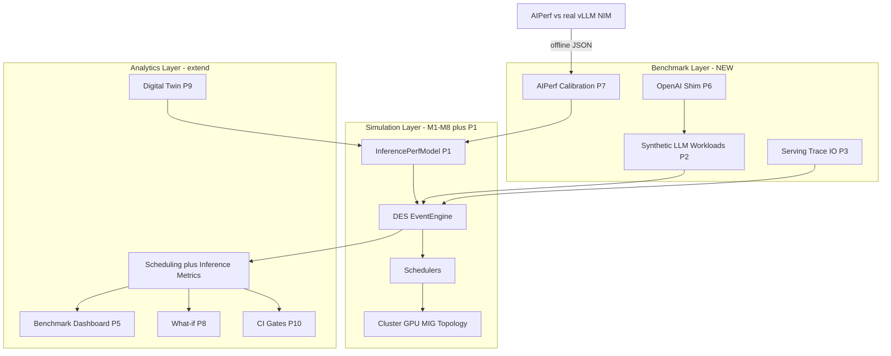

# ForgeSim Benchmark Platform

ForgeSim extends from **GPU scheduler simulation** (M1–M8) into a platform that connects **scheduling decisions** to **end-to-end LLM serving metrics** — TTFT, inter-token latency (ITL), tokens/sec, goodput, queue delay, GPU utilization, and cost.

This document is the canonical roadmap for the Benchmark and Analytics layers. It incorporates a multi-model architecture review (Composer 2.5 Fast + Grok 4.5 High Fast) and maps ten proposed features to phased delivery with UI, unit tests, and integration tests per phase.

See also: [Architecture](architecture.md) · [Milestones](milestones.md) · [UI dashboard](ui_dashboard.md) · [Manual test guide](manual_test_benchmark_platform.md)

---

## Vision

Today ForgeSim answers: *“How does this scheduler policy allocate GPUs and affect queue wait / utilization?”*

The benchmark platform adds: *“How does that scheduling policy affect LLM serving SLOs — and how do simulated predictions compare to measured AIPerf results?”*

```text
                    ForgeSim
                        │
         Scheduler Simulation
                        │
      ┌─────────────────┴─────────────────┐
      ▼                                   ▼
 Event Simulation              Performance Validation
                                       │
                            GenAI-Perf / AIPerf
                                       │
                                       ▼
                      Compare Simulation vs Reality
```

**Positioning:** ForgeSim does not replace AIPerf or real inference servers. External benchmark tools become **calibration and validation plugins**. The simulator remains runnable without GPUs.

**Differentiator:** First open-source platform that couples scheduler placement with LLM serving KPIs, calibrated from real measurements where available.

---

## Three-layer architecture



| Layer | Responsibility | Current state |
|-------|----------------|---------------|
| **Simulation** | DES, schedulers, cluster, MIG, topology, RL | M1–M8 complete |
| **Benchmark** | Workload/trace I/O, AIPerf calibration, OpenAI virtual endpoint | Greenfield (`benchmarks/` placeholder) |
| **Analytics** | Dashboard, reports, digital twin, what-if, CI regression | Scheduling UI exists; inference KPIs missing |

### Integration boundaries

| Component | Owner | Rationale |
|-----------|-------|-----------|
| Inference timing that affects GPU contention | **Rust** (`forgesim-core`) | DES invariant: core never depends on Python |
| AIPerf subprocess, JSON import/export | **Python** (`python/forgesim/benchmarks/`) | External tool orchestration |
| OpenAI HTTP shim | **Python** (`python/forgesim/server/`) | Request ingress; requires auth before ship |
| Dashboard / compare / replay | **Next.js + FastAPI** | Extend existing `web/` — no second app |

---

## Ten features → phases

| # | Feature | Phase | Notes |
|---|---------|-------|-------|
| 4 | **Inference Performance Model** | **P1** | **Gate** — must precede honest TTFT/TPS claims |
| 3 | Synthetic LLM workload generator | P2 | Diurnal RAG/chat/training patterns |
| 2 | Serving trace replay (export/import) | P3 | `serving.trace.v1` — not M3 scheduler traces |
| 6 | Scheduler benchmark score | P4 | Metric vector first; weighted composite optional |
| 9 | Benchmark dashboard UI | P5 | Extend `web/` metrics and compare |
| 5 | OpenAI-compatible virtual endpoint | P6 | Auth + rate limits required |
| 1 | LLM benchmark plugin (AIPerf) | P7 | Offline calibration import — not in-loop GPU harness |
| 8 | What-if analysis | P8 | Cluster/scheduler/workload sweeps |
| 7 | Digital twin | P9 | Persistent calibration store + drift detection |
| 10 | CI/CD performance testing | P10 | Golden sim fixtures; live AIPerf optional nightly |

**P0 (prerequisite):** Harden simulation + web replay before new layers.

**Do not start with Feature 1 (AIPerf alone)** without P1 — reviewers flagged this as mislabeled scheduling metrics.

**First demo milestone:** P1 + P7 + P5 — simulated TTFT/TPS from calibrated profiles, AIPerf import, **Simulated vs Measured** dashboard.

---

## Critical semantics (multi-model consensus)

These distinctions block incorrect implementation:

| Term | What it is today | What it must become |
|------|------------------|---------------------|
| `time_to_first_start` | Queue wait until first GPU allocation | **Not TTFT** — keep separate |
| `runtime` | Scalar job duration (training-centric) | Derived from model + tokens + batch + GPU profile (P1) |
| M3 trace (`trace.rs`) | Scheduler oracle: JobSubmitted/Scheduled/Completed | **Not** LLM request traces |
| AIPerf | External benchmark against real endpoints | **Calibration import** into profiles — not co-simulation inside DES |

New inference metrics (P1): `ttft_p50`, `ttft_p99`, `itl_p50`, `tps_mean`, `goodput`, `queue_delay_p99` — distinct from scheduling wait fields.

---

## Phase details

### P0 — Simulation hardening (~2 weeks)

**Goal:** Trust existing analytics before adding LLM metrics.

| Area | Deliverables |
|------|--------------|
| **Work** | Wire `StartRunRequest.scheduler` in `python/forgesim/server/app.py`; replay from engine `decisions` (not `step_fifo()`); persist run metadata hash under `outputs/runs/` |
| **UI** | Verify run detail replay matches configured scheduler |
| **Unit tests** | Rust scheduler override; Python server passes scheduler to Rust |
| **Integration** | `integration.rs` preemptive via API path; `python/tests/test_server_scheduler.py`; replay decision smoke |

---

### P1 — Inference performance model (~4–6 weeks) ⭐

**Goal:** Estimate runtime and serving KPIs from model + tokens + GPU type.

| Area | Deliverables |
|------|--------------|
| **Rust** | Extend `Job` in `crates/forgesim-core/src/models.rs` (`model_id`, `input_tokens`, `output_tokens`, `batch_size`, `concurrency`); new `inference.rs` analytical model; extend `SimulationMetrics` in `forgesim-metrics` |
| **Profiles** | v2 schema in `configs/profiles/`: `prefill_ms_per_token`, `decode_tps`, `max_batch` |
| **Python** | Profile v2 loader in `python/forgesim/adapters/profiles.py` |
| **UI** | TTFT/TPS tiles in `web/src/components/MetricsCharts.tsx` when inference jobs present |
| **Unit tests** | Monotonicity: ↑tokens ⇒ ↑duration; ↑concurrency ⇒ ↑TTFT; serde round-trip |
| **Integration** | `configs/workloads/inference_llama.yaml` → metrics JSON contains `ttft_p50`; scheduler compare changes TTFT when queueing differs |

---

### P2 — Synthetic LLM workload generator (~3 weeks)

| Area | Deliverables |
|------|--------------|
| **Work** | `python/forgesim/workloads/generate_synthetic.py`; documented schema; presets (Morning RAG, Peak Chat, Night Training) |
| **UI** | Workload preset picker on dashboard |
| **Unit tests** | Deterministic seed; validator rejects invalid tokens |
| **Integration** | Golden `tests/fixtures/workloads/synthetic_llm_peak.yaml` |

---

### P3 — Serving trace import/export (~3 weeks)

| Area | Deliverables |
|------|--------------|
| **Rust** | `crates/forgesim-config/src/serving_trace.rs`; CLI `--serving-trace` / `--export-serving-trace` |
| **Python** | `python/forgesim/adapters/serving_trace.py` — AIPerf trace mapping |
| **Schema** | `serving.trace.v1` JSONL: `{time, model, input_tokens, output_tokens}` |
| **UI** | Run detail export button |
| **Integration** | Round-trip fixture `tests/fixtures/traces/serving_llama.jsonl` |

---

### P4 — Scheduler benchmark score (~2 weeks)

| Area | Deliverables |
|------|--------------|
| **Rust** | `SchedulerBenchmarkReport` in `forgesim-metrics`; fairness (Jain index), fragmentation, optional composite score |
| **Config** | `configs/analytics/cost.yaml` — GPU-hour rates |
| **Docs** | [benchmark_score.md](benchmark_score.md) — weight definitions |
| **UI** | Extended `ComparePanel` with serving + scheduling columns |
| **Integration** | Golden `tests/fixtures/benchmark/score_vector.json` |

---

### P5 — Benchmark dashboard UI (~3 weeks)

| Area | Deliverables |
|------|--------------|
| **UI** | `web/src/app/benchmark/page.tsx` — scheduler/model selectors, TTFT/TPS/latency/util/goodput panels |
| **API** | `GET /api/benchmark/reports`, `POST /api/benchmark/run` |
| **Integration** | API test loads report; sim vs measured overlay (fixture) |

---

### P6 — OpenAI-compatible endpoint (~3 weeks)

| Area | Deliverables |
|------|--------------|
| **Work** | `python/forgesim/server/openai_shim.py` — `POST /v1/chat/completions` → virtual queue → SSE stream |
| **Security** | API key auth, rate limits, localhost bind by default |
| **Docs** | [openai_shim.md](openai_shim.md) |
| **Integration** | OpenAI client against shim; deterministic TTFT for fixed seed |

---

### P7 — AIPerf calibration plugin (~4 weeks) ⭐

| Area | Deliverables |
|------|--------------|
| **Work** | `python/forgesim/benchmarks/aiperf_adapter.py` — export sim workload; import AIPerf JSON → profiles |
| **CLI** | `python -m forgesim.benchmarks.aiperf import results.json --profile llama-70b-h100` |
| **Fixtures** | `tests/fixtures/aiperf/` — offline golden artifacts (no GPU in CI) |
| **UI** | Import upload; **Simulated vs Measured** chart |
| **Integration** | Re-run sim after import → TTFT within tolerance of measured |

**Workflow:**

```text
ForgeSim sim → Export benchmark config/trace → AIPerf → vLLM/NIM → Metrics JSON → Import → Update profiles/twin
```

---

### P8 — What-if analysis (~3 weeks)

| Area | Deliverables |
|------|--------------|
| **Work** | `python/forgesim/benchmarks/sweep.py`; cluster templates in `configs/clusters/templates/` |
| **API** | `POST /api/what-if` — sweep cluster × scheduler × workload |
| **UI** | `web/src/app/what-if/page.tsx` — scenario matrix, Pareto chart (TTFT vs util) |

---

### P9 — Digital twin (~6 weeks)

| Area | Deliverables |
|------|--------------|
| **Store** | `outputs/twins/` or SQLite: `{gpu_type, model, ttft, tps, throughput, measured_at, aiperf_run_id}` |
| **Pipeline** | AIPerf import → twin entry → profile auto-update; drift detection |
| **UI** | Twin library page; run detail calibration badge |

Example twin entry:

```yaml
H100:
  llama70b:
    ttft_ms: 220
    tps: 210
    throughput: 1800
    measured_at: "2026-01-15"
    aiperf_run_id: abc123
```

---

### P10 — CI/CD performance testing (~3 weeks)

| Area | Deliverables |
|------|--------------|
| **CI** | `.github/workflows/benchmark.yml` — required: golden sim diff; optional nightly: live AIPerf |
| **Fixtures** | `benchmarks/ci/` thresholds + golden runs |
| **Output** | PR comment: scheduler accuracy, util Δ, latency Δ, TTFT Δ |

---

## Trace schemas (do not conflate)

| Schema | Purpose | Location |
|--------|---------|----------|
| `scheduler.trace.v1` | M3 oracle replay — placement decisions | `crates/forgesim-config/src/trace.rs` |
| `serving.trace.v1` | LLM request arrivals for AIPerf replay | P3 — new |
| `JobsTimeline` | Post-run Gantt export | M8 — `forgesim-metrics` |

---

## Test matrix (summary)

| Phase | Rust unit | Python unit | Integration | UI |
|-------|-----------|-------------|-------------|-----|
| P0 | scheduler override | server scheduler | API + replay | manual |
| P1 | `inference.rs`, metrics | profiles v2 | inference E2E | TTFT tiles |
| P2 | workload validate | generator | golden YAML | preset picker |
| P3 | `serving_trace.rs` | adapter | round-trip | export button |
| P4 | score vector | cost yaml | compare goodput | compare panel |
| P5 | types | API routes | benchmark report | benchmark page |
| P6 | — | shim + auth | curl client | settings |
| P7 | — | import/export | golden import | sim vs measured |
| P8 | templates | sweep | 3-variant sweep | what-if page |
| P9 | — | twin store | calibrate loop | twin library |
| P10 | golden metrics | threshold | workflow | PR comment |

Run existing tests: see [milestones.md](milestones.md#running-tests).

---

## Review findings (act / consider / dismissed)

### Act on (both reviewers)

- P1 before AIPerf/OpenAI/dashboard TTFT claims
- Separate `serving.trace.v1` from M3 traces
- AIPerf as offline calibration only
- Auth before OpenAI shim
- Extend existing web — no duplicate benchmark app
- P0 replay/scheduler fixes first

### Consider

- Analytical serving submodel in Rust; Python for I/O only
- Pareto compare before single composite score
- Fix FastAPI `:8080` auth gap alongside shim

### Dismissed / noted

- GenAI-Perf dual adapter — use AIPerf only in v1
- Default dashboard credentials — dev-only; document in UI guide
- Cost charts — explicit model in P4 or defer

---

## Key files (planned)

| Phase | Paths |
|-------|-------|
| P0 | `python/forgesim/server/app.py` |
| P1 | `crates/forgesim-core/src/inference.rs`, `models.rs`, `forgesim-metrics` |
| P2 | `python/forgesim/workloads/generate_synthetic.py` |
| P3 | `crates/forgesim-config/src/serving_trace.rs`, `python/forgesim/adapters/serving_trace.py` |
| P4 | `docs/benchmark_score.md`, `configs/analytics/cost.yaml` |
| P5 | `web/src/app/benchmark/page.tsx` |
| P6 | `python/forgesim/server/openai_shim.py`, `docs/openai_shim.md` |
| P7 | `python/forgesim/benchmarks/aiperf_adapter.py`, `tests/fixtures/aiperf/` |
| P8 | `python/forgesim/benchmarks/sweep.py`, `web/src/app/what-if/page.tsx` |
| P9 | `outputs/twins/` |
| P10 | `.github/workflows/benchmark.yml`, `benchmarks/ci/` |

---

## Execution order

```text
P0 → P1 → (P2 ∥ P3) → P4 → P5 → P6 → P7 → P8 → P9 → P10
```

P2 and P3 can run in parallel after P1. P10 can start after P4 golden fixtures exist, but full CI gates land last.
